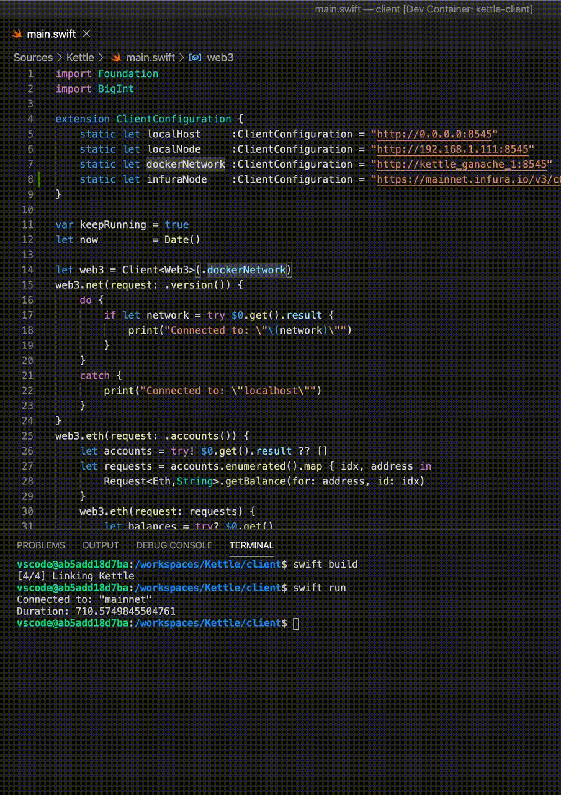

# Overview



### 1. Build the `Swift 5.2` image first
`$ docker build client/Swift-5.2 --tag swift:5.2-development`

### 2. Start Ganache
`$ docker-compose up -d ganache`

### Open `Kettle/client` from within VS Code

You'll need to install _Remote Containers_ extension:
```
	Name: Remote - Containers
	Id: ms-vscode-remote.remote-containers
	Description: Open any folder inside (or mounted into) a container and take advantage of Visual Studio Code's full feature set.
	Version: 0.94.0
	Publisher: Microsoft
	VS Marketplace Link: https://marketplace.visualstudio.com/items?itemName=ms-vscode-remote.remote-containers
```

Afterwards, you can build the remote container and start debugging.
  > _Dockerfile_ is located in: `Kettle/client/.devcontainer/Dockerfile`

To build & run the client, use VS Code's Terminal window, and type `swift run` in the prompt
