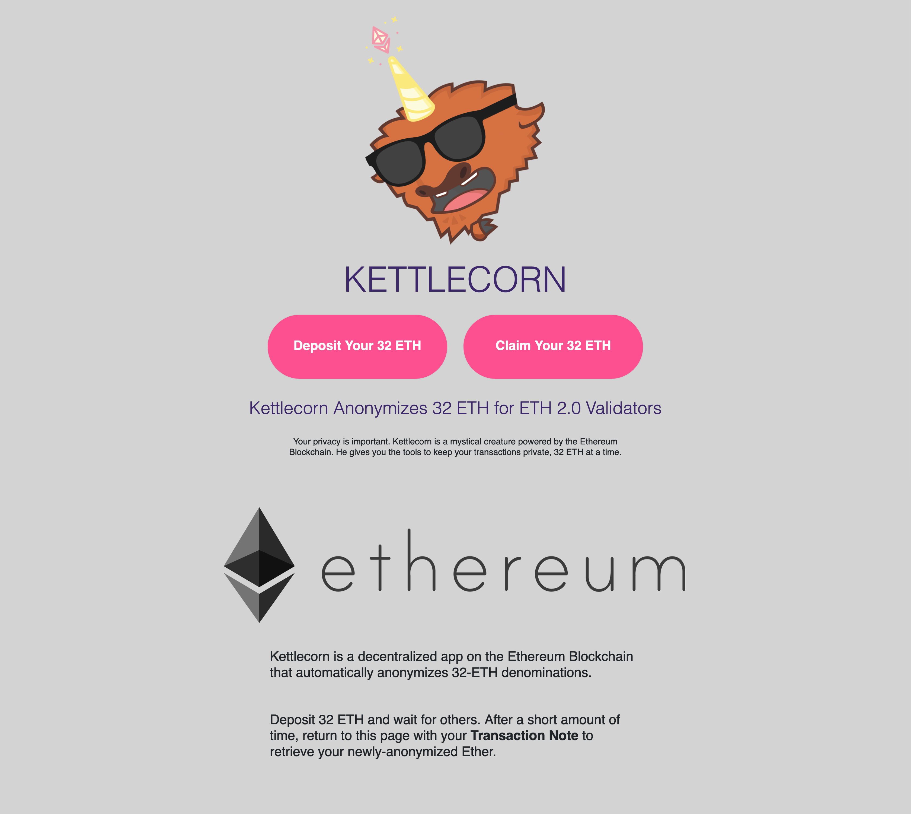
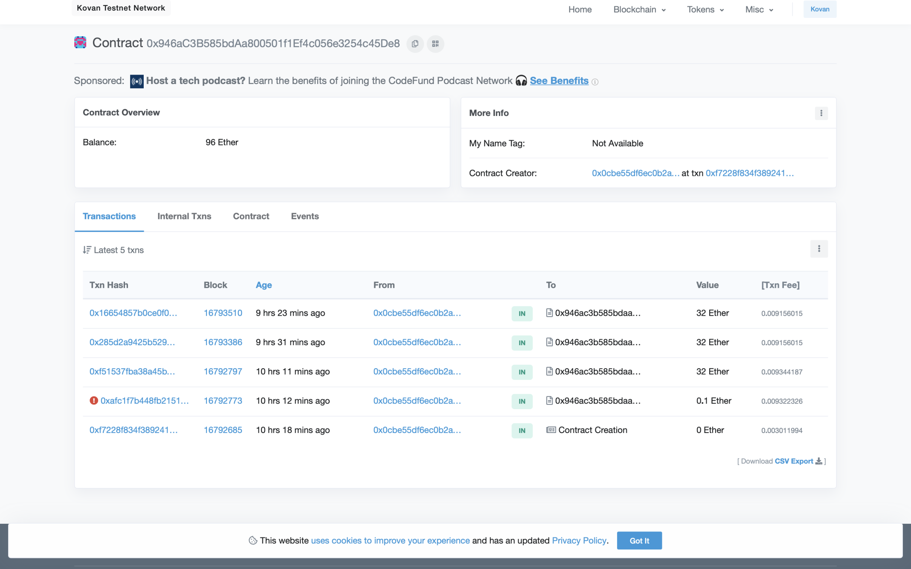
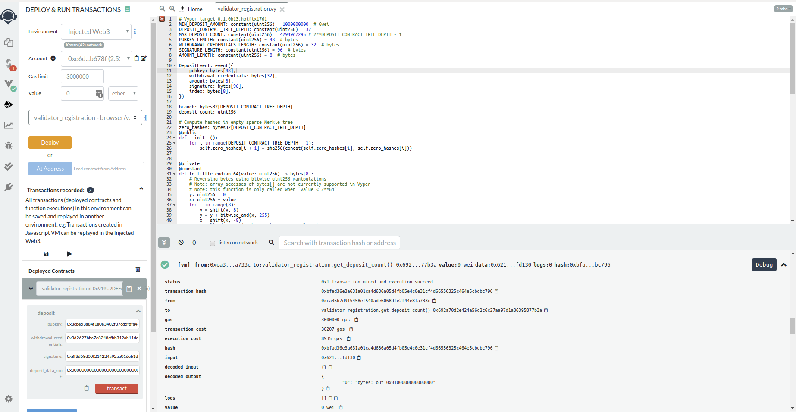

Kettlecorn
========

## Kettlecorn is a dapp that allows ETH-holders that want to validate in Ethereum 2.0 Phase 0 an easy way to anonymize their deposits to the beacon chain deposit contract on Ethereum mainnet.

### Development Roadmap
#### Part 1:
- [x] Compile and deploy deposit contract to Kovan Test Network.
- [x] Upload and verify the source code on Etherscan.
- [x] Use Carl Beek’s Ethereum 2.0 Toolkit to generate credentials to perform deposits to the deposit contract. 
- [ ]  We created a dapp to tie the workflow together and walk the user through tornado deposit, withdrawal, credentials generation for Eth 2.0, and then deposit to the beacon chain deposit contract.

We feel that this historic migration of ETH from Ethereum 1.0 to 2.0 with consistent deposit/transfer amounts of 32 ETH could provide a high likelihood of anonymity for new and long time users of Ethereum 1.0 that have little to no privacy on the current mainnet.

Link to deposit contract with verified source code on Etherscan:
https://kovan.etherscan.io/address/0x91996Be8aCEE088e77512365Ffc4EE522ff9DFFA#code

