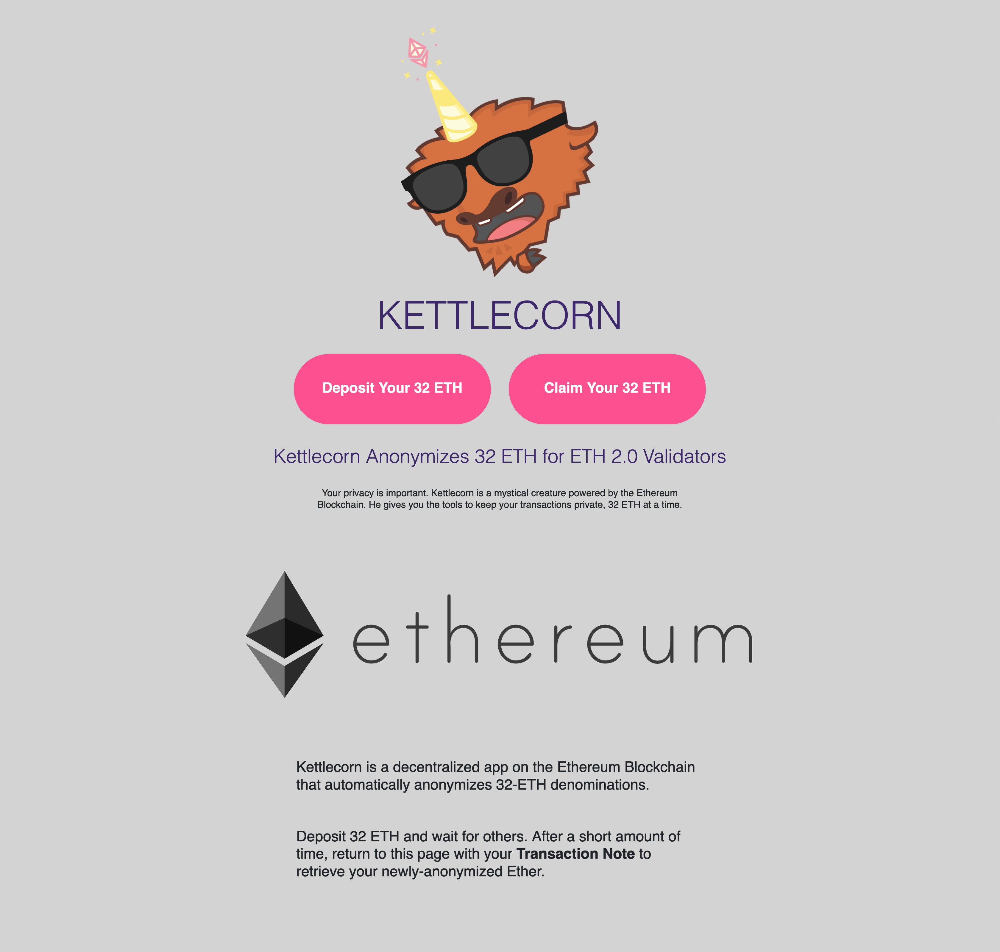

Kettlecorn
========

## The Kettlecorn team is proud to be the 1st prize winner of ETHDenver 2020's ETH2 bounty. Thank you to everyone who was at the event, judges, hackathon participants, and sponsors for helping make ETHDenver possible!

<blockquote class="twitter-tweet" data-lang="en" data-theme="dark">
We had a great time at <a href="https://twitter.com/EthereumDenver?ref_src=twsrc%5Etfw">@EthereumDenver</a> last weekend! Incredible hacks all around :)  Shout-out to the winners of the eth2 bounties:  1st, $2500 - Kettlecorn - Anonymous Eth 2 Deposit Dapp<a href="https://twitter.com/TornadoCash?ref_src=twsrc%5Etfw">@TornadoCash</a> mod to accept 32 ETH deposits<a href="https://t.co/3158p6arnk">https://t.co/3158p6arnk</a>  (2nd and 3rd below 👇)
&mdash; dannyryan (@dannyryan) <a href="https://twitter.com/dannyryan/status/1229613927044173824?ref_src=twsrc%5Etfw">February 18, 2020</a></blockquote> 

### Kettlecorn is a decentralized application (dapp) that allows ETH-holders that want to validate in Ethereum 2.0 Phase 0 an easy way to anonymize their deposits to the beacon chain deposit contract on Ethereum Mainnet. We feel that this historic migration of ETH from Ethereum 1.0 to 2.0, with consistent deposit/transfer amounts of 32 ETH, could provide a high likelihood of anonymity for new and long-time users of Ethereum 1.0 that have little-to-no privacy on the current mainnet.

## Development Roadmap
### Part 1:
- [x] Compile and deploy deposit contract to Kovan Test Network
- [x] Upload and verify the source code on Etherscan
- [x] Use Carl Beek’s Ethereum 2.0 Toolkit to generate credentials to perform deposits to the deposit contract
- [X] Create a dapp to tie the workflow together 
  - [ ] Walk the user through deposit, withdrawal, credentials generation for Eth 2.0, and then deposit to the beacon chain deposit contract.

### Part 2:
Create a dapp to tie the workflow together and walk the user through Tornado Cash deposit, withdrawal, credentials generation for Eth 2.0, and then deposit to the beacon chain deposit contract.

## Additional Information

### Project Workflow

### Deposit contract with verified source code on Etherscan
### https://kovan.etherscan.io/address/0x91996Be8aCEE088e77512365Ffc4EE522ff9DFFA#code

### Remix screenshot of 32-ETH contract deposits
